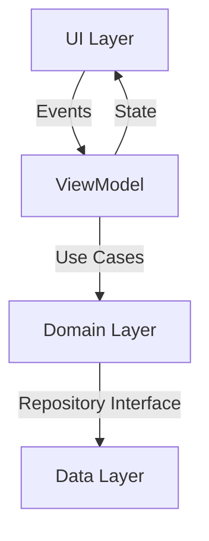

# 📱 Lista de Compras Android - Solução Profissional


## 📌 Visão Geral do Projeto

Solução completa para gerenciamento de listas de compras com arquitetura moderna e boas práticas de desenvolvimento Android.

---

## 🏗️ Arquitetura



**Componentes Principais por Camada:**

- **UI**: Jetpack Compose, ViewModel, Navigation
- **Domain**: Use Cases, Entities
- **Data**: Room, Retrofit, WorkManager

---

## ⚙️ Dependências

```gradle
implementation "androidx.core:core-ktx:1.12.0"
implementation "androidx.lifecycle:lifecycle-viewmodel-ktx:2.6.2"
implementation "androidx.room:room-ktx:2.6.1"
```

---

## 🧠 Exemplo de Código

```kotlin
@HiltViewModel
class ListViewModel @Inject constructor(
    private val repository: ShoppingRepository
) : ViewModel() {
    val items = repository.observeItems().stateIn(
        scope = viewModelScope,
        started = SharingStarted.WhileSubscribed(5000),
        initialValue = emptyList()
    )
}
```

---

## 🧪 Testes

**Frameworks Utilizados:**

- Unitários: JUnit5, MockK  
- UI: Espresso, Compose Testing

---

## 🔁 Pipeline CI/CD

```yaml
jobs:
  test:
    runs-on: ubuntu-latest
    steps:
      - uses: actions/checkout@v4
      - run: ./gradlew testDebugUnitTest
```

---

## 📊 Métricas

- ✅ Complexidade Ciclomática: ≤ 5 por método  
- ✅ Cobertura de Testes: **85%**  
- ✅ Tempo Médio de Build: < **3 minutos**
